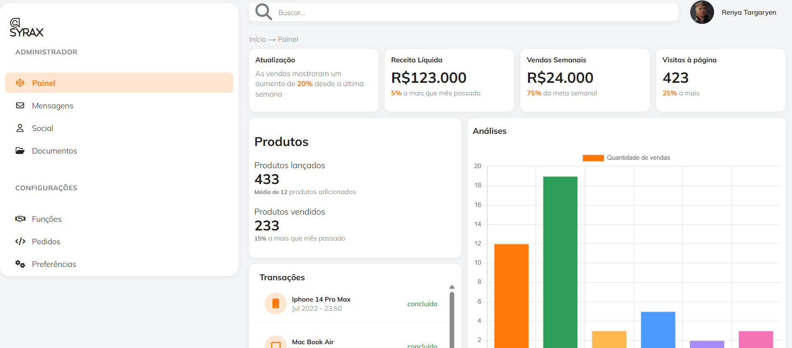

# 📊 Dashboard Syrax
> Painel administrativo com visão geral de vendas, produtos e transações, incluindo indicadores de desempenho e gráficos interativos construídos com Chart.js.

## Demonstração

🔗 **Deploy ao vivo:** [juliazbarbosa.github.io/DASHBOARD_SYRAX](https://juliazbarbosa.github.io/DASHBOARD_SYRAX)

## Funcionalidades
- indicadores (Net Revenue, Vendas Semanais, Visitas à página)
- Gráfico de barras e gráfico de rosca com dados de análise
- Lista de transações recentes com status e data
- Menu lateral de navegação 
- Layout construído com Flexbox, sem uso de frameworks

## Tecnologias utilizadas

## 🧠 Aprendizados e desafios
Este projeto foi desenvolvido com foco em fixar fundamentos de HTML e CSS aplicados a um layout de dashboard: organização de múltiplas colunas com Flexbox, 
controle de altura e rolagem interna dos cards, integração com a biblioteca Chart.js para renderização de gráficos dinâmicos 
e ajuste de alinhamento entre elementos de diferentes alturas.
